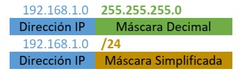

# UNIDAD 1: ELEMENTOS CLAVE DE UNA INFRAESTRUCTURA DE RED

## EL PROTOCOLO IP

### ¿QUE ES?
- El protocolo IP (Internet Protocol) es uno de los más utilizados y más importantes de los que operan
en la capa 3 del modelo OSI. Ya que permite la comunicación entre dispositivos conectados a redes distintas.
Para ello, se le asigna una numeración a cada equipo, que lo identifica de forma úniva dentro de la misma red, conocida como dirección IP.

- Una dirección IP consiste en un numero binario de **32 bits**, divido en grupos de **4 octetos** (8 bits; lo que implica que cada octeto podrá tomar valores **de 0 hasta 255** como máximo), separados por puntos. La forma más común de representarla es en formato decimal, como por ejemplo **192.168.200.255**

### CLASES DE DIRECCIONES IP

- Según su numeración, distinguiremos 5 clases diferentes de direcciones IP:


### DIRECCIONAMIENTO PRIVADO
- No obstante, dentro de cada clase existen rangos privados de direccionamiento. Estos rangos son los que usaremos cuando estemos configurando los dispositivos englobados en una misma red LAN y cuyas direcciones no deban ser visibles desde internet. Son los siguientes:


### DIRECCIONAMIENTO RESERVADO
- Además, también existen ciertos rangos de **direcciones reservadas**, que no deben usarse excepto para el uso que tienen asignados, como pueden ser el **127.0.0.0/8** que se utiliza para direcciones de Loopback, o el **0.0.0.0/0** que se utiliza como Ruta por Defecto.

- Al resto de direccionamiento que no se incluye en los rangos privados y reservados, lo llamaremos **direcciones públicas**, que son las que se usan en **Internet**.

### ESTRUCTURA DE UNA DIRECCIÓN IP
- En una dirección IP vamos a diferenciar 2 partes, la izquierda o **identificador de red**, y la derecha o **identificador de host**. Como se ha visto en la tabla anterior, dependiendo de la clase a la que pertenezca una dirección IP, su red tendrá un tamaño por defecto para cada una de esas partes, que sería el siguiente:


### LA MÁSCARA DE RED
- Para indicarnos la cantidad de bits pertenece a cada una de estas partes, tenemos la máscara de red. Se trata de un indicador númerico con el mismo tamaño y distribución de bits que una dirección IP, y que suele indicarse a continuación de esta.
- Podemos expresarla tanto en formato decimal (similar a una IP) o en formato abreviado o CIDR (Classles Inter-Domain Routing), con un /N, siendo N el número de bits usados para el identificador de red. Lo vemos en el siguiente ejemplo:



## LOS PUERTOS LÓGICOS

### ¿QUE SON?
-  Son como interfaces virtuales que permiten la comunicación entre diferentes aplicaciones o servicios en una misma computadora o entre distintas computadoras a través de la red. Son identificadores númericos de 16 bits, a través de los cuales podemos conocer que servicio o protocolo se está usando.

### TIPOS DE PUERTOS LÓGICOS
- Tanto en TCP como en UDP tenemos un total de 65535 puertos disponibles, tenemos una clasificación dependiendo del número de puerto a utilizar, que es la siguiente:
    - **Puertos conocidos:** los puertos conocidos (well-known en inglés) van desde el puerto **0 hasta al 1023**, están registrados y asignados por la Autoridad de Números Asignados de Internet (IANA), a los servicios y protocolos de red más comunes.
    - **Puertos registrados:** los puertos registrados van desde el puerto **1024 hasta al 49151**. La principal diferencia de estos puertos, es que las diferentes organizaciones pueden hacer solicitudes a la IANA para que se le otorgue un determinado puerto por defecto, y se le asignará para su uso con una aplicación en concreto.
    - **Puertos dinámicos:** estos puertos van desde el **49152 hasta el 65535**, este rango de puertos se utiliza por los programas del cliente y están constantemente reutilizándose. Este rango de puertos normalmente se utiliza cuando está transmitiendo a un puerto conocido o reservado desde otro dispositivo, como en el caso de web o FTP. Por ejemplo, cuando nosotros visitamos una web, el puerto de destino siempre será el 80 (HTTP) o el 443 (HTTPS), pero como puerto origen se usará uno dinámico.

### PUERTOS MÁS USADOS


## PRINCIPALES PROTOCOLOS DE RED
- 

### ARP
- Es un protocolo de capa 2. Se encarga de asociar la dirección
MAC de cada maquina, a su dirección IP.
ADDRESS RESOLUTION PROTOCOL
***
PROTOCOLO DE RESOLUCIÓN DE
DIRECCIONES
- Cuando un equipo intenta comunicarse por primera vez con otra maquina de su red, se enviará previamente una "petición ARP", en forma de mensaje de broadcast a todos los equipos de la red.
- De modo que solo responderá el equipo que tenga la MAC con la que queramos comunicarnos.
- Así, cada equipo de la red irá generando lo que llamamos su "Tabla ARP", en la que iran quedando registradas las direcciones MAC de cada máquina, asociada con su dirección IP correspondiente.

### ICMP
 Es un protocolo de capa 3. Nos sirve para comprobar si tenemos conectividad con otro dispositivos de nuestra red o de otra distinta. Esto lo hace generando paquetes IP de un tamaño concreto y enviándolos a otra máquina de la red para ver si responde.
- Herramientas como **ping** y **traceroute** utilizan ICMP para probar la disponibilidad de un destino, medir tiempos de respuesta o mostrar la ruta que siguen los paquetes.

### DNS
- Se considera un servicio de capa 7. Es un servicio o funcionalidad, que nos permite acceder o comunicarnos con otros equipos o recursos de una red, utilizando su nombre de dominio e incluso un alias.
- Evitando así tener que recordar la dirección IP de cada maquina, que sería mucho más complejo.
- Para ello, tendremos configurado en nuestra red uno o más servidores DNS, a los cuales les enviaremos peticiones cada vez que nos comunicamos con otro equipo a través de su nombre de dominio; y estos realizaran la traducción de ese nombre o alias, a la dirección IP que le corresponde.
- Este servicio funciona de manera totalmente transparente para el usuario.

### NAT
- Mecanismo mediante el cual podemos traducir una o varias direcciones IP privadas (locales), en una o varios IP públicas (globales) y viceversa. De esta forma, los equipos de una red local pueden acceder a internet sin que sus direcciones IP privadas sean visibles fuera de su red local.
- A parte de esta, la principal función de NAT es la de conservar el espacio global IPv4 y evitar su agotamiento. Ya qué gracias a él, podemos conseguir que utilizando una sola IP pública, salgan internet todos los equipos de una red local. Distinguimos 3 tipos de NAT:
	- **NAT Estático:** asigna de forma manual una dirección IP pública a una dirección privada. Mapeo “uno a uno” permanente.
	- **NAT Dinámico:** consiste en asignar un grupo de direcciones públicas a una red local, de modo que los dispositivos podrán ir utilizando dinámicamente esas direcciones públicas para salir a internet y dejarlas libres cuando terminen. Mapeo “uno a uno” temporal.
	- **NAT con Sobrecarga:** también conocido como PAT (Port Address Translation), permite asignar una IP pública a toda una red y que los dispositivos la utilicen de forma simultanea para salir a internet. Realizándose la diferenciación entre equipos por puertos. Mapeo “uno a varios”.

- :information_source: Aclaración:
    ```c#
    - Dirección local interna: la dirección de origen vista desde el interior de la red.
    - Dirección global interna: la dirección de origen vista desde la red externa.
    - Dirección global externa: la dirección del destino vista desde la red externa.
    - Dirección local externa: la dirección del destino vista desde la red interna.
    ```

### DHCP
- Es un protocolo de capa 7. Nos permite configurar varios parámetros de conectividad (dirección IP, Máscara, Puerta de Enlace, Servidores DNS...) de manera automática, en las diferentes máquinas conectadas a una red.
- Para ello, debemos configurar previamente uno de los equipos de red, para que ejecute dicho servicio, es decir, hará la función de servidor. De modo que cada vez que un equipo se conecte a dicha red, solamente tengamos que activar en él, la funcionalidad DHCP (Cliente, que generalmente viene habilitada por defecto) y realizará la petición de forma automática, obteniendo así su configuración de red, sin necesidad de hacerlo manualmente equipo por equipo.